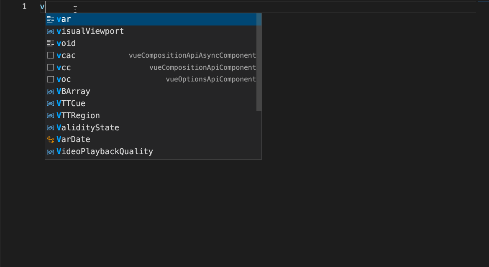
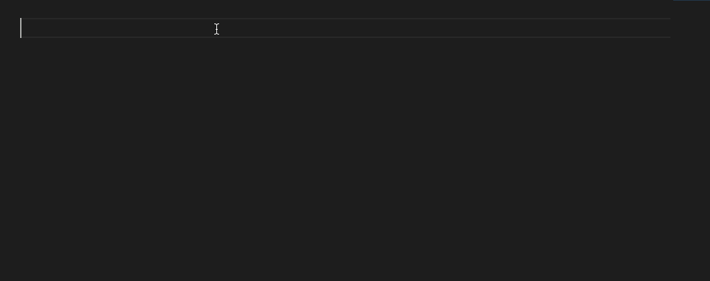
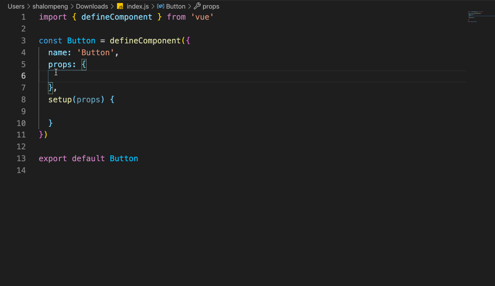
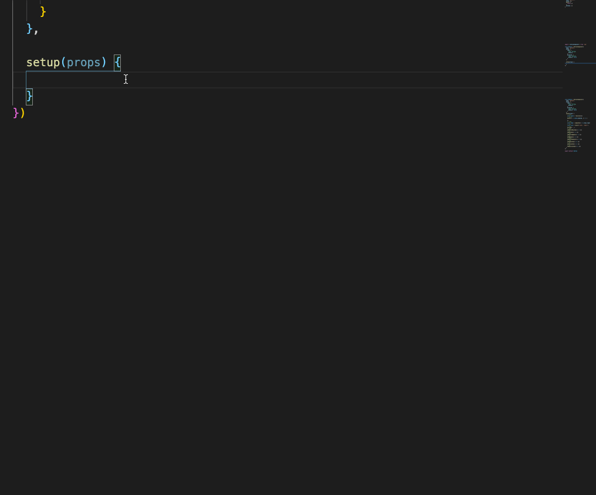

# vue3-composition-snippets 
[install in visualstudio marketplace](https://marketplace.visualstudio.com/items?itemName=psaren.vue3-composition-snippets)

## Features
This snippets extension is contains a lot of vue3 / vuex /vue-router composition api shortscuts

For example :
- Vue Composition Component（vcc）

- Vue Option Component(voc)

- Vue prop shortcuts

|Prefix |	JavaScript Snippet Content |
| ---- | ---- |
| prop | {type: ,default: } |
| propBoolean | {type: Boolean,default: false} |
| propNumber | {type: Number,default: } |
| propString | {type: String,default: ''} |
| propArray | {type: Array,default: () => []} |
| propObject | {type: Object,default: ()=>({})} |

- more shortcuts

|Prefix |	JavaScript Snippet Content |
| ---- | ---- |
| reactive | const state = reactive({}) |
| inject | const name = inject('name', name)) |
| provide | provide('', ) |
| obm/onBeforeMounted | onBeforeMounted(() => {}) |
| om/onMounted | onMounted(() => {}) |
| obu/onBeforeUpdate | onBeforeUpdate(() => {}) |
| obum/onBeforeUnmount | onBeforeUnmount(() => {}) |
| oum/onUnmounted | onUnmounted(() => {}) |
| od/onDeactivated | onDeactivated(() => {}) |
| oa/onActivated | onActivated(() => {}) |
| oec/onErrorCaptured | onErrorCaptured(() => {}) |
| ort/onRenderTriggered | onRenderTriggered(() => {}) |
| watch | watch(()=> , () => {}) |
| watchi | watch(()=> , () => {}, { immediate: true }) |
| we/watchEffect | watchEffect(() => {}) |
| wpe/watchPostEffect | watchPostEffect(() => {}) |
| wse/watchSyncEffect | watchSyncEffect(() => {}) |

- store / router shortcuts

|Prefix |	JavaScript Snippet Content |
| ---- | ---- |
| us/useStore | const store = useStore() |
| sc/storeCommit | store.commit() |
| ss/storeState | store.state |
| sg/storeGetters | store.getters |
| sd/storeDispatch | store.dispatch() |
| useRouter | const router = useRouter() |
| useRoute | const route = useRoute() |
| useLink | const {  } = useLink() |
| rr/routerReplace | router.replace() |

## Known Issues

## Release Notes

### 1.0.0

Initial release of vue3 snippets

## License
[MIT](./LICENSE)

-----------------------------------------------------------------------------------------------------------

**Enjoy!**
